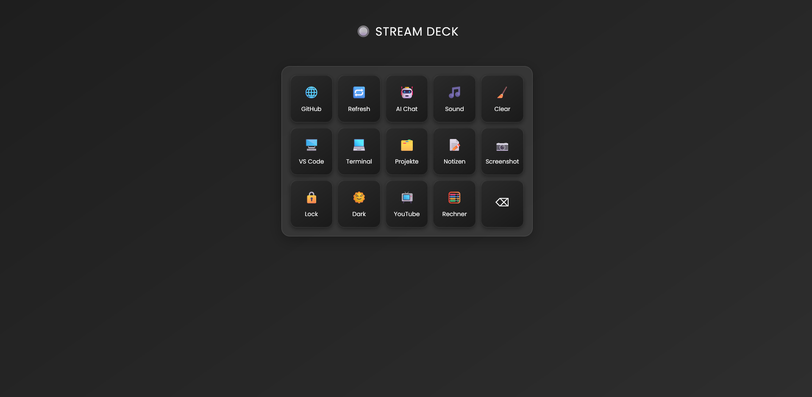

# Stream Deck Clone



A simple web-based Stream Deck clone with customizable buttons for quick actions like opening links, toggling dark mode, taking screenshots, and chatting with AI.

## Features

- Grid of interactive buttons with icons and labels  
- Open websites like GitHub, YouTube, VS Code Web  
- Toggle Dark and Light modes  
- Play sounds on button clicks  
- Screenshot flash effect  
- Simple AI chat overlay  
- Console clear and alerts  
- Responsive and modern UI

## Installation

To get this project running locally:

```bash
git clone https://github.com/your-username/streamdeck-clone.git
cd streamdeck-clone
# Open index.html in your browser or use a local server

Usage

    Click the buttons to perform their respective actions

    Use the AI Chat button to open the chat overlay

    Press Escape to close the chat overlay

    Toggle Dark/Light mode with the Dark button

Technologies Used

    HTML5 & CSS3

    JavaScript (Vanilla)

    Google Fonts (Poppins)

License

This project is licensed under the MIT License. See the LICENSE file for details.